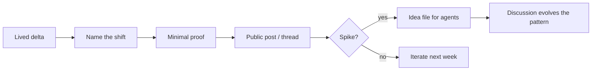

# Agent-era idea literacy (Cursor skills)

## The problem

You ship a correct insight and it still dies: the post is too polished to feel true, or too vague to spread, or the “repo drop” lands as **noise** because everyone’s stack differs. In the agent era, the scarce artifact is often not code—it is a **pattern your agent can instantiate**. Without a repeatable release path, you re-learn the same presentation mistakes on every launch.

> The failure mode is not “bad writing.” It is **missing a compression step**: a handle for the shift, a proof small enough to verify, and a handoff file that survives the hype cycle.

## The solution

This repo packages **four small skills**—each a checklist you can drop into Cursor (or any agent workflow) when you are publishing a technical idea: how to surface a paradigm change, how to prove it in miniature, how to promote a viral moment into an **idea file**, and how to keep bold claims honest with one concrete discipline.

| Skill | Folder | What it fixes |
| ----- | ------ | ------------- |
| Paradigm Surface | `skills/paradigm-surface/` | Opens with lived workflow change + names the new abstraction |
| Proof in Miniature | `skills/proof-in-miniature/` | Pairs a strong claim with the smallest falsifiable artifact |
| Idea File Handoff | `skills/idea-file-handoff/` | Turns attention into an agent-readable spec, not a frozen app |
| Hype–Discipline Pairing | `skills/hype-discipline-pairing/` | Welds autonomy hype to one verification habit you actually use |

## Ground truth (micro-story)

**[Builder]** ships an internal memo: “agents changed how we code.” Engagement is flat—reads like every other slide. They rewrite the opening to a **two-week personal delta** (“I stopped editing functions; I started editing *policies* for agents”), add **one label** for the shift, and link a **20-line script** that proves the loop once. A noisy thread follows. Instead of dumping a private `.cursor` folder, they publish a **gist-style idea file**: headings, constraints, and a paste block for *any* agent. The idea forks without the repo becoming support hell.



## Quickstart (one copy-paste block)

```bash
# Clone into a workspace (adjust path)
git clone https://github.com/ERerGB/karpathy-idea-pattern-skillset.git ~/karpathy-idea-pattern-skillset
cd ~/karpathy-idea-pattern-skillset

# Install into Cursor user skills (merge; does not delete existing skills)
mkdir -p ~/.cursor/skills
cp -R skills/paradigm-surface ~/.cursor/skills/
cp -R skills/proof-in-miniature ~/.cursor/skills/
cp -R skills/idea-file-handoff ~/.cursor/skills/
cp -R skills/hype-discipline-pairing ~/.cursor/skills/

# Re-run the cp commands anytime you pull updates — same paths overwrite cleanly
```

In chat: reference a skill by path, e.g. “follow `~/.cursor/skills/idea-file-handoff/SKILL.md`.”

## X / Tweet workflow

| File | Purpose |
| ---- | ------- |
| `tweet.config.yaml` | Parameterized slots (`post`, `article`, `comment`) for tweet-skill style workflows |
| `doc/narrative-core.md` | Single source of truth paragraph for mission checks |
| `doc/x-thread-starter.md` | Thread-shaped draft; put the **link in the last tweet** when promoting the repo |

## References and prior art

| Concept | Reference | Relation to this repo |
| ------- | --------- | --------------------- |
| Idea file (spec over repo dump) | [Karpathy gist — LLM Wiki / idea file](https://gist.github.com/karpathy/442a6bf555914893e9891c11519de94f) | Pattern-level handoff for agents |
| Vibe coding (naming a workflow shift) | Public coinage and discussion on X, 2025 | **Label the abstraction** step |
| Agent orchestration surface | MCP, IDE integrations, tool permissions | **Paradigm Surface** inventory style |
| Technical leadership writing | “Problem → story → system” README craft | This README follows the same scannability discipline |

**Disclaimer:** This is an **independent literacy pack** inspired by recurring public patterns in how prominent engineers publish ideas. It is **not** affiliated with or endorsed by any individual; use it as a template, not impersonation.

## Repository layout

```
skills/
  paradigm-surface/SKILL.md
  proof-in-miniature/SKILL.md
  idea-file-handoff/SKILL.md
  hype-discipline-pairing/SKILL.md
doc/
  narrative-core.md
  x-thread-starter.md
tweet.config.yaml
LICENSE
```

## License

MIT — see `LICENSE`.
